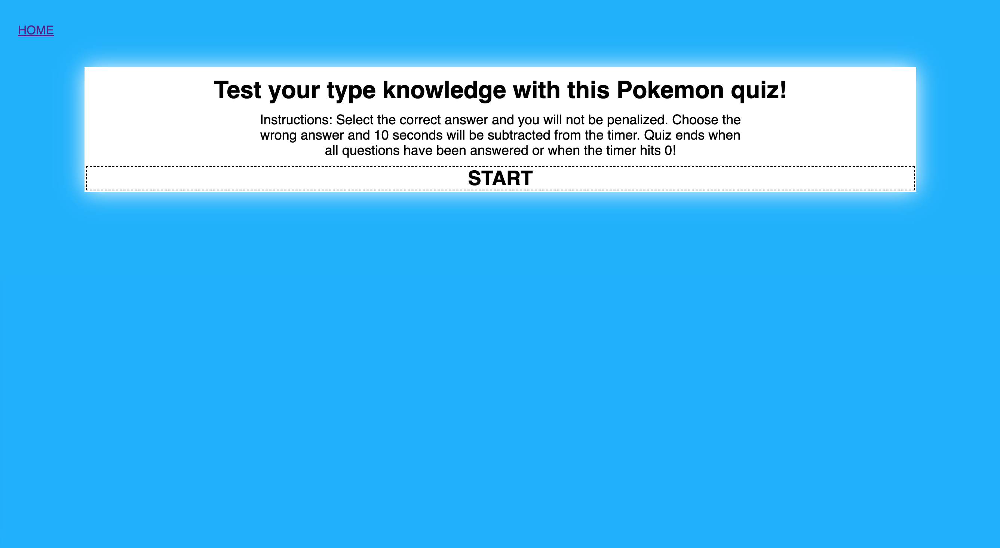

# Code Quiz

## Description
For this assignment, we were given the task to create a functional quiz that allowed the user to be timed, asked questions, penalized for wrong answers, and then given an opportunity to add their initials to a scoreboard. The goal was to use our knowledge of JavaScript to create a quiz. Personally, JavaScript was frustrating to learn. During class, I'd be able to understand the concepts for some student activities. But I had the hardest time applying it without any starter code. The last assignment showed me that I had a lot to work on outside of class.

With this quiz, I felt a lot more confident in the language. It really helped to pseudocode almost every step so that I did not miss anything. Still, I had a hard time figuring out how to properly use the localStorage since it was a new concept we just went through. In the end, this quiz looks dramatically different from the previous assignment and has much more function to it.

## Website
Here is a screenshot of the homepage of my Code Quiz as well as a random first question once you click START.

## Link
Here is the [link](https://dejesusf.github.io/code-quiz/) to the deployed code quiz.